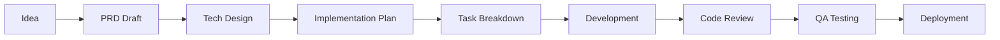

# Nexis 项目管理文档

**版本：** 1.0  
**更新日期：** 2026-02-16  
**项目负责人：** evol (AI PM)

---

## 目录

1. [项目概览](#项目概览)
2. [开发流程](#开发流程)
3. [里程碑规划](#里程碑规划)
4. [团队协作](#团队协作)
5. [质量保证](#质量保证)
6. [发布管理](#发布管理)
7. [风险管理](#风险管理)

---

## 项目概览

### 产品定位

**Nexis** - AI 原生团队协作平台

**核心价值：**
- AI 作为一等公民，而非插件
- 统一语义层，打破文档/消息/表格边界
- 主动协作，而非被动响应
- 多 AI 协作能力

**目标用户：**
- 技术团队（MVP）
- 产品团队（Phase 3）
- 企业组织（Phase 4）

### 技术栈

| 层级 | 技术选型 | 理由 |
|------|---------|------|
| 后端核心 | Rust 1.75+ | 性能 + 安全 + 并发 |
| Web 框架 | Axum | 类型安全 + 异步 |
| 前端 | React 18 + TypeScript | 生态 + 类型安全 |
| 数据库 | PostgreSQL 15+ | 可靠性 + 扩展性 |
| 向量存储 | Qdrant | 高性能向量搜索 |
| AI 集成 | MCP 协议 | 标准化 AI 接口 |

### 当前状态

**Phase: MVP (Phase 2)**

| 模块 | 完成度 | 状态 |
|------|--------|------|
| nexis-protocol | 90% | ✅ Ready |
| nexis-core | 85% | ✅ Ready |
| nexis-gateway | 80% | ✅ Ready |
| nexis-runtime | 60% | 🔄 In Progress |
| nexis-mcp | 40% | 🔄 Stub |
| nexis-cli | 30% | 📝 Planned |
| Web 前端 | 20% | 📝 Stub |

---

## 开发流程

### 1. Sprint 周期

**Sprint 长度：** 2 周  
**Sprint 节奏：**

```
Week 1:
  Mon   Sprint Planning（2h）
  Tue-Fri 开发 + Daily Standup（15min）

Week 2:
  Mon-Thu 开发 + Daily Standup（15min）
  Fri    Sprint Review（1h）+ Retrospective（1h）
```

### 2. 需求流程



#### PRD 模板

```markdown
# [功能名称] PRD

## 背景与价值
- 用户痛点是什么？
- 为什么现在做？
- 预期收益是什么？

## 功能范围
- Must Have（P0）
- Should Have（P1）
- Nice to Have（P2）

## 用户故事
作为 [角色]，我希望 [行为]，以便 [收益]

## 验收标准
- [ ] Given-When-Then 1
- [ ] Given-When-Then 2

## 技术方案
（链接到 Tech Design Doc）

## 风险与依赖
- 技术风险
- 外部依赖
- 时间风险

## 指标
- 成功指标
- 监控指标
```

### 3. 分支管理

```
main (protected)
  ├── develop (integration)
  │   ├── feat/core-member-identity
  │   ├── feat/gateway-websocket
  │   └── fix/cli-connection-bug
  └── release/0.2.0
```

**分支命名规范：**
- `feat/<scope>-<feature>` - 新功能
- `fix/<scope>-<issue>` - Bug 修复
- `refactor/<scope>-<desc>` - 重构
- `docs/<desc>` - 文档
- `test/<scope>-<desc>` - 测试

### 4. Code Review 标准

**必须检查：**
- [ ] 代码符合项目规范（rustfmt + clippy）
- [ ] 有足够的单元测试（覆盖率 ≥ 80%）
- [ ] 有集成测试（如适用）
- [ ] 有文档注释（public API）
- [ ] 无安全漏洞（cargo audit）
- [ ] 性能可接受（无性能回退）
- [ ] 错误处理完整
- [ ] 日志级别合理

**Review 时限：**
- P0 PR：4 小时内响应
- P1 PR：1 工作日内响应
- P2 PR：2 工作日内响应

---

## 里程碑规划

### Phase 1: Foundation ✅ (已完成)

**时间：** 2026-01 ~ 2026-02  
**目标：** 协议 + 核心架构

**完成内容：**
- ✅ NIP-001/002/003 协议规范
- ✅ 核心身份系统
- ✅ 消息协议实现
- ✅ Gateway WebSocket 基础

### Phase 2: MVP (当前)

**时间：** 2026-02 ~ 2026-04  
**目标：** 可用的原型系统

#### Sprint 2.1: AI Provider 集成 (2 weeks)

**目标：** 真实 AI 调用能力

**任务清单：**
- [ ] OpenAI Provider 实际实现
  - [ ] Chat Completions API
  - [ ] Streaming 响应
  - [ ] 错误重试机制
  - [ ] Rate Limiting
- [ ] Anthropic Provider 实现
  - [ ] Messages API
  - [ ] Streaming
- [ ] Provider Registry
  - [ ] 动态注册
  - [ ] 健康检查
- [ ] 测试
  - [ ] Mock Server 测试
  - [ ] 集成测试

**验收标准：**
- [ ] 可以通过 CLI 调用 OpenAI API
- [ ] 支持流式响应
- [ ] 错误重试工作正常

#### Sprint 2.2: 消息持久化 (2 weeks)

**目标：** 数据持久化能力

**任务清单：**
- [ ] PostgreSQL Schema 设计
  - [ ] Rooms 表
  - [ ] Messages 表
  - [ ] Members 表
  - [ ] 索引优化
- [ ] SQLx 集成
  - [ ] 连接池
  - [ ] Migration 系统
- [ ] Repository 层实现
  - [ ] RoomRepository
  - [ ] MessageRepository
  - [ ] MemberRepository
- [ ] 测试
  - [ ] Repository 单元测试
  - [ ] 集成测试（Testcontainers）

**验收标准：**
- [ ] 消息可以持久化到 PostgreSQL
- [ ] 支持消息历史查询
- [ ] 性能符合要求（1000 msg/s）

#### Sprint 2.3: CLI 客户端 (2 weeks)

**目标：** 可用的命令行客户端

**任务清单：**
- [ ] CLI 交互模式
  - [ ] REPL
  - [ ] 命令历史
  - [ ] 自动补全
- [ ] 核心命令
  - [ ] login / logout
  - [ ] create-room / join-room
  - [ ] send / reply
  - [ ] invite-member
  - [ ] list-rooms / list-members
- [ ] AI 交互
  - [ ] @ai 触发
  - [ ] 流式输出显示
- [ ] 测试
  - [ ] E2E 测试

**验收标准：**
- [ ] 可以通过 CLI 完成基本操作
- [ ] 可以与 AI 对话
- [ ] 用户体验流畅

#### Sprint 2.4: 集成测试 (2 weeks)

**目标：** 完整的测试覆盖

**任务清单：**
- [ ] E2E 测试框架
  - [ ] Testcontainers 集成
  - [ ] 测试数据工厂
- [ ] 场景测试
  - [ ] 用户注册 → 登录 → 创建房间
  - [ ] AI 加入 → 对话 → 工具调用
  - [ ] 多用户协作
- [ ] 性能测试
  - [ ] 并发连接
  - [ ] 消息吞吐量
  - [ ] 延迟分布
- [ ] CI 集成
  - [ ] 自动化测试
  - [ ] 测试报告

**验收标准：**
- [ ] 核心场景测试覆盖率 100%
- [ ] 性能基准建立
- [ ] CI 自动化通过

### Phase 3: Intelligence

**时间：** 2026-05 ~ 2026-07  
**目标：** 语义理解和知识管理

**关键功能：**
- 向量存储（Qdrant）
- 上下文引擎
- 知识图谱
- 语义搜索

### Phase 4: Scale

**时间：** 2026-08 ~ 2026-10  
**目标：** 企业级能力

**关键功能：**
- 多租户支持
- 联邦协议
- Web UI
- 移动应用

---

## 团队协作

### 1. 会议节奏

| 会议 | 频率 | 时长 | 参与人 | 目的 |
|------|------|------|--------|------|
| Sprint Planning | 每 2 周 | 2h | 全员 | 规划 Sprint |
| Daily Standup | 每日 | 15min | 开发 | 同步进度 |
| Sprint Review | 每 2 周 | 1h | 全员 + Stakeholder | 演示成果 |
| Retrospective | 每 2 周 | 1h | 全员 | 改进流程 |
| Tech Design Review | 按需 | 1h | Tech Lead | 技术方案 |
| 1:1 | 每周 | 30min | Manager + Member | 个人发展 |

### 2. 沟通渠道

| 渠道 | 用途 | 响应时间 |
|------|------|----------|
| GitHub Issues | 任务跟踪 | 1 工作日 |
| GitHub PR | 代码审查 | 4 小时（P0） |
| Discord #dev | 日常讨论 | 4 小时 |
| Discord #alert | 紧急问题 | 15 分钟 |
| Email | 正式沟通 | 1 工作日 |

### 3. 文档协作

**文档层级：**
1. **产品文档** (docs/)
   - PRD
   - Roadmap
   - Changelog
   
2. **技术文档** (docs/plans/)
   - 架构设计
   - API 设计
   - 数据模型
   
3. **运维文档** (docs/ops/)
   - 部署指南
   - 监控配置
   - 故障处理

4. **代码文档**
   - README.md
   - 代码注释
   - API Docs (cargo doc)

---

## 质量保证

### 1. 测试策略

```
       ┌─────────────┐
       │   E2E Test  │ (10%)
       └─────────────┘
      ┌───────────────┐
      │ Integration   │ (20%)
      │     Test      │
      └───────────────┘
     ┌─────────────────┐
     │   Unit Test     │ (70%)
     └─────────────────┘
```

**测试覆盖率要求：**
- 单元测试：≥ 80%
- 关键路径：100%
- 新增代码：≥ 90%

**测试类型：**
- [x] 单元测试 - cargo test
- [x] 集成测试 - tests/
- [ ] E2E 测试 - Testcontainers
- [ ] 性能测试 - Criterion
- [ ] 安全测试 - cargo audit + CodeQL

### 2. Code Quality Gates

**Pre-commit:**
```bash
cargo fmt -- --check
cargo clippy -- -D warnings
cargo test
cargo audit
```

**CI Pipeline:**
```yaml
1. Format Check
2. Clippy Lint
3. Unit Tests
4. Integration Tests
5. Documentation Build
6. Security Audit
7. CodeQL Analysis
8. Coverage Report
```

**PR Merge Requirements:**
- [ ] 所有 CI 检查通过
- [ ] 至少 1 个 approve
- [ ] 无未解决的 conversation
- [ ] 覆盖率未降低
- [ ] 无 merge conflict

### 3. 性能基准

**关键指标：**

| 指标 | 目标值 | 测量方法 |
|------|--------|----------|
| WebSocket 连接延迟 | < 50ms | P95 |
| 消息发送延迟 | < 100ms | P95 |
| AI 响应首字节 | < 2s | P95 |
| 并发连接数 | 1000+ | 压测 |
| 消息吞吐量 | 10k msg/s | 压测 |

**性能回退检测：**
- 每次 PR 运行基准测试
- 性能回退 > 5% 需要说明
- 性能回退 > 10% 需要 Tech Lead 审批

---

## 发布管理

### 1. 版本规范

**语义化版本：** MAJOR.MINOR.PATCH

- **MAJOR：** 不兼容的 API 变更
- **MINOR：** 向后兼容的功能新增
- **PATCH：** 向后兼容的问题修复

**示例：**
- `0.1.0` → `0.2.0`：新增功能
- `0.2.0` → `0.2.1`：Bug 修复
- `0.x.x` → `1.0.0`：正式发布

### 2. 发布流程


### 3. 发布 Checklist

**Pre-release:**
- [ ] 所有 P0 bug 已修复
- [ ] 所有测试通过
- [ ] 文档已更新
- [ ] Changelog 已更新
- [ ] 版本号已更新
- [ ] 性能基准无回退

**Release:**
- [ ] 创建 release branch
- [ ] 创建 git tag
- [ ] 构建发布产物
- [ ] 部署到 staging
- [ ] 执行 smoke test
- [ ] 部署到 production
- [ ] 发布公告

**Post-release:**
- [ ] 监控错误率
- [ ] 收集用户反馈
- [ ] 更新 roadmap

### 4. Changelog 格式

```markdown
# [0.2.0] - 2026-03-15

## Added
- Feature: AI provider integration (OpenAI, Anthropic)
- Feature: Message persistence with PostgreSQL

## Changed
- Improvement: Optimized WebSocket connection handling

## Fixed
- Bug: Resolved message duplication issue

## Security
- Security: Upgraded dependencies to fix CVE-2026-XXXX

## Breaking Changes
- API: Changed `/api/rooms` response format
```

---

## 风险管理

### 1. 技术风险

| 风险 | 影响 | 概率 | 缓解措施 |
|------|------|------|----------|
| AI Provider API 不稳定 | 高 | 中 | 多 Provider 支持 + Fallback |
| 性能瓶颈 | 高 | 中 | 早期性能测试 + 优化 |
| 数据库扩展性 | 中 | 低 | 分库分表方案 + Caching |
| 依赖库漏洞 | 高 | 低 | 定期 audit + 及时升级 |

### 2. 项目风险

| 风险 | 影响 | 概率 | 缓解措施 |
|------|------|------|----------|
| 需求变更 | 中 | 高 | MVP 范围锁定 + 迭代式开发 |
| 资源不足 | 高 | 中 | 优先级管理 + 外包部分工作 |
| 延期风险 | 中 | 中 | Buffer time + 并行开发 |
| 技术债务 | 中 | 高 | 每周技术债务偿还时间 |

### 3. 应急预案

**Severity Levels:**

| 级别 | 定义 | 响应时间 | 处理时间 |
|------|------|----------|----------|
| P0 - Critical | 服务不可用 | 15 分钟 | 4 小时 |
| P1 - High | 核心功能受损 | 1 小时 | 24 小时 |
| P2 - Medium | 非核心功能问题 | 4 小时 | 3 天 |
| P3 - Low | 小问题/优化 | 1 工作日 | 下个版本 |

**On-call 流程：**
1. 接收告警（Discord + Email）
2. 确认问题 severity
3. 创建 Incident Channel
4. 通知 Stakeholder（P0/P1）
5. 定位 + 修复
6. Postmortem（P0/P1）

---

## 附录

### A. 工具清单

**开发工具：**
- Rust: rustfmt, clippy, cargo-watch, cargo-audit
- Git: pre-commit hooks
- IDE: VSCode + rust-analyzer

**CI/CD:**
- GitHub Actions
- Docker
- Kubernetes（未来）

**监控：**
- Logs: tracing + JSON
- Metrics: Prometheus（未来）
- Tracing: Jaeger（未来）

### B. 参考资源

- [Rust API Guidelines](https://rust-lang.github.io/api-guidelines/)
- [Conventional Commits](https://www.conventionalcommits.org/)
- [Semantic Versioning](https://semver.org/)
- [Google Engineering Practices](https://google.github.io/eng-practices/)

---

**最后更新：** 2026-02-16  
**维护者：** evol (AI PM)  
**反馈：** 在 GitHub Issues 中提交
