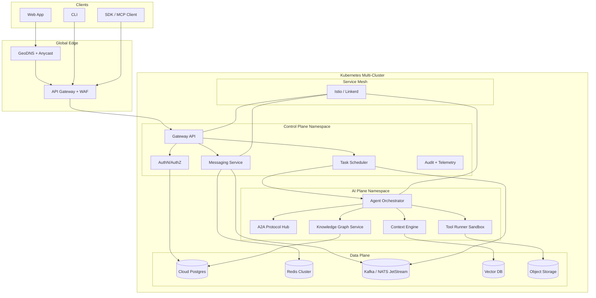

# Nexis Roadmap（2026-02-27）：Cloud Native + High Concurrency + AI Native

## 1. 愿景与目标

Nexis 在 2026-2027 的核心升级方向：
- Cloud Native First：以 Kubernetes 为基础运行时，服务治理默认 Service Mesh。
- Extreme Concurrency：单 Region 支持 100K+ 并发连接，P95 端到端延迟 < 80ms。
- AI Native System：多 Agent 协同、A2A 协议、自治工作流成为一等能力。

对标架构基线（吸收模式，不复制实现）：
- Google SRE + Borg/Kubernetes 体系：声明式运维、SLO 驱动、自动扩缩容。
- Microsoft Cloud + Copilot 体系：多租户隔离、企业级治理与安全合规。
- OpenAI Agent/Tooling 体系：工具调用标准化、推理与执行分层、可审计自治。

量化目标（到 Phase 7 结束）：
- Availability：99.95%（控制面），99.9%（AI 执行面）。
- Concurrency：>= 100,000 活跃 WebSocket 连接/Region。
- Latency：P95 < 80ms（消息投递），P99 < 150ms。
- Throughput：>= 1,000,000 messages/min 峰值。
- AI 协作：>= 70% 复杂任务可由多 Agent 自动分解并闭环。
- 成本效率：单位千次请求成本下降 35%（相对 Phase 4 基线）。

---

## 2. 技术架构图

架构关键点：
- 控制面（Control Plane）与 AI 执行面（AI Plane）解耦，降低耦合故障半径。
- 数据平面按用途分层：事务（Postgres）、缓存（Redis）、流处理（Kafka/NATS）、语义检索（Vector DB）。
- Service Mesh 提供 mTLS、流量治理、可观测统一入口。

---

## 3. Phase 5-7 路线图

### Phase 5（Cloud Native Foundation）
时间：2026-03-01 ~ 2026-05-31

目标：完成 Kubernetes 原生化、服务治理和基础 SRE 能力。

交付项：
- K8s 部署标准化：
  - 所有核心服务容器化并迁移到 K8s Deployment/StatefulSet。
  - HPA/VPA + PodDisruptionBudget + PriorityClass 生效。
- Helm Charts：
  - 产出 `nexis-core`、`nexis-ai-plane`、`nexis-observability` 三套 Chart。
  - 支持 dev/staging/prod values 分层。
- Service Mesh：
  - 引入 Istio（首选）或 Linkerd（轻量替代）。
  - 默认 mTLS、熔断、重试、金丝雀发布。
- 云原生数据库：
  - Postgres 高可用（主从 + 自动故障转移）。
  - Redis Cluster + 持久化策略。
- 容器优化：
  - 基础镜像最小化（distroless/alpine），SBOM 与镜像签名。

技术指标（Phase 5 Exit Criteria）：
- 服务上云率：100%（核心服务）。
- 部署频率：>= 每周 10 次，变更失败率 < 10%。
- MTTR：< 30 分钟。
- Mesh 覆盖率：>= 90% 服务间流量。

### Phase 6（100K+ Concurrency）
时间：2026-06-01 ~ 2026-09-30

目标：实现高并发低延迟，完成容量压测与性能治理闭环。

交付项：
- 连接池与连接管理优化：
  - DB 池化分层（读写分离、租户隔离池）。
  - WebSocket Gateway 支持分片会话与无状态扩展。
- 负载均衡与流量治理：
  - L4/L7 负载均衡 + 一致性哈希（会话粘性可配置）。
  - 热点路由与背压机制。
- 消息队列：
  - Kafka（高吞吐）或 NATS JetStream（低延迟）双模式。
  - Outbox + 幂等消费 + 死信队列。
- 缓存策略：
  - Redis 多级缓存（本地 L1 + 分布式 L2）。
  - TTL/主动失效/防击穿策略。
- 性能基准：
  - 建立持续压测（k6 + 自研 WS 基准），纳入 CI Nightly。

技术指标（Phase 6 Exit Criteria）：
- 并发连接：>= 100,000 / Region。
- 消息投递延迟：P95 < 80ms，P99 < 150ms。
- 峰值吞吐：>= 1M msg/min。
- 错误率：< 0.1%。

### Phase 7（AI Native Platform）
时间：2026-10-01 ~ 2027-02-28

目标：实现 A2A 协议、多 Agent 编排、上下文引擎与自治工作流。

交付项：
- A2A 协议：
  - 统一 Agent 身份、能力声明、任务握手与回调语义。
  - 支持跨 Agent 消息签名与可信执行链。
- 多 Agent 编排：
  - 支持 `parallel / sequential / debate / vote` 协作模式。
  - 调度器支持 SLA、成本预算、能力标签路由。
- 上下文引擎：
  - 短期会话记忆 + 长期语义记忆融合。
  - 动态上下文裁剪与优先级注入。
- 知识图谱：
  - 领域实体、关系抽取与版本化。
  - 与向量检索联合召回（graph + vector hybrid）。
- 自主工作流：
  - 任务分解、工具调用、结果验证、失败恢复闭环。
  - 审批门禁（高风险动作需 human-in-the-loop）。

技术指标（Phase 7 Exit Criteria）：
- Agent 任务自动闭环率：>= 70%。
- A2A 成功握手率：>= 99.5%。
- 工具调用成功率：>= 99%。
- 自主工作流平均完成时长：较人工流程缩短 >= 40%。

---

## 4. 专家团队结构

### 4.1 组织模型
- Chief Architect（1）：架构基线、ADR 审核、关键技术选型。
- Platform Squad（4-6）：K8s、Mesh、CI/CD、可观测、SRE。
- Realtime Squad（3-5）：网关、连接管理、消息系统、性能优化。
- AI Systems Squad（4-6）：A2A、编排器、上下文引擎、知识图谱。
- Data Infra Squad（3-4）：Postgres、Redis、MQ、向量库、数据治理。
- Security & Compliance（2-3）：身份、安全基线、审计、供应链安全。
- DX & Quality（2-3）：开发效率、测试金字塔、代码规范与质量门禁。

### 4.2 角色职责
- 架构师角色：
  - 维护技术北极星、容量模型、演进路线一致性。
- 领域专家分工：
  - 每个领域有 DRI（Directly Responsible Individual）和备份 Owner。
- 技术债务管理：
  - 每个 Sprint 固定 20% 容量用于债务偿还与重构。
  - 按“风险 x 影响 x 修复成本”打分排序。
- 代码审查流程：
  - 双人审查 + 自动化门禁（测试、性能、SAST、依赖漏洞）。
  - 高风险模块需架构师或安全专家额外审批。

---

## 5. 技术选型

### 5.1 云原生与平台
- Orchestration：Kubernetes（EKS/GKE/AKS 均可，优先当前云栈一致性）。
- Packaging：Helm + Kustomize（环境差异管理）。
- Service Mesh：Istio（功能完备）/ Linkerd（简洁低开销）。
- API Gateway：Envoy Gateway / Kong / NGINX Ingress（按现网能力选型）。

### 5.2 高并发与数据
- Messaging：Kafka（高吞吐事件流）或 NATS JetStream（低延迟控制流）。
- Cache：Redis Cluster + Redis Streams。
- DB：Cloud Postgres + 读副本 + 分区表策略。
- Vector：Milvus / pgvector / Weaviate（按运维成本与检索性能选择）。

### 5.3 AI 原生能力
- Orchestration Runtime：可插拔 Agent Runtime（策略驱动调度）。
- A2A：Nexis A2A v1（内部协议）并预留 MCP/开放协议映射层。
- Knowledge：Graph DB（Neo4j/JanusGraph）+ Vector DB 混合检索。
- Guardrails：策略引擎（OPA/自研）+ Prompt/Tool 调用审计。

### 5.4 选型原则
- 默认选择可观测、可回滚、可水平扩展方案。
- 先满足 SLO，再做功能拓展。
- 降低单点厂商锁定，核心能力抽象接口化。

---

## 6. 风险与缓解

| 风险 | 描述 | 缓解策略 | 触发阈值 |
|---|---|---|---|
| 架构复杂度失控 | 微服务与 Mesh 引入运维复杂度 | 先核心域拆分，非核心保持模块化单体；建立 ADR 审核 | 新增服务 > 3/月 |
| 性能回归 | 高并发改造导致延迟波动 | 压测前置、性能预算、容量红线告警 | P95 > 100ms 连续 3 天 |
| 成本失控 | K8s + MQ + AI 资源成本上升 | FinOps 看板、自动伸缩、闲时降配 | 月成本 > 预算 120% |
| AI 误动作 | 自主工作流执行高风险操作 | Human approval gate、策略沙箱、回滚补偿 | 高风险动作自动执行率 > 0 |
| 数据一致性 | MQ/缓存引入最终一致性挑战 | Outbox/幂等键/重放机制 | 重复消费率 > 0.5% |
| 安全合规 | 多 Agent 与工具调用扩大攻击面 | mTLS、最小权限、密钥轮换、供应链扫描 | 高危漏洞未修复 > 7 天 |

---

## 7. 时间线（里程碑）

- 2026-03-15：Phase 5 M1
  - K8s 基础设施与首批服务迁移完成。
- 2026-04-30：Phase 5 M2
  - Helm + Mesh + 可观测性全链路打通。
- 2026-05-31：Phase 5 Exit
  - Cloud Native 基线达成，进入高并发专项。

- 2026-07-15：Phase 6 M1
  - 连接管理与缓存策略升级完成。
- 2026-08-31：Phase 6 M2
  - MQ 主链路、背压与容错机制上线。
- 2026-09-30：Phase 6 Exit
  - 100K+ 并发与延迟指标达标。

- 2026-11-15：Phase 7 M1
  - A2A v1 + 多 Agent 基础编排可用。
- 2026-12-31：Phase 7 M2
  - 上下文引擎 + 知识图谱联动上线。
- 2027-02-28：Phase 7 Exit
  - 自主工作流闭环达成，AI Native 目标验收。

---

## 附：执行与治理机制（建议）

- 每两周一次 Architecture Review：验证指标达成与 ADR 一致性。
- 每月一次 Reliability Review：复盘 SLO、事故、成本。
- 每季度一次 Capability Review：评估 AI 原生能力成熟度与业务价值。
