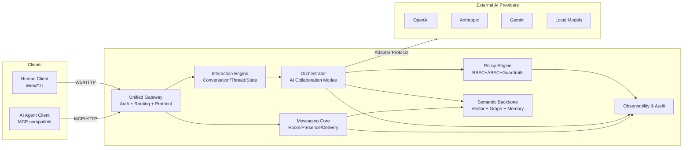
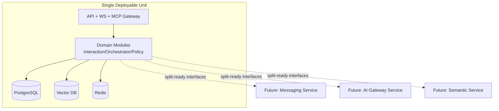

# Nexis 架构设计（Hybrid: Monolith First, Split-Ready）

**日期：** 2026-02-14  
**决策基线：** 方案 C（混合部署：先单体，接口按拆分预留）  
**核心目标：** AI 协作执行 + 完整通讯能力（人-人、人-AI、AI-AI）

---

## 0. 设计原则与边界

1. **执行优先**：先实现可运行闭环，避免过早分布式复杂度。
2. **AI 一等公民**：AI 与人类统一身份、统一消息协议、统一权限框架。
3. **AI 负责人级权限**：AI 默认具备负责人级操作能力，但受策略引擎和审计约束。
4. **单体内模块化**：通过明确领域边界与内部接口，为后续拆分微服务做准备。
5. **协议先行**：统一交互模型 + 统一 AI 网关协议 + 语义中枢抽象。

---

## 1. 系统架构图

### 1.1 逻辑架构（MVP 单体）



### 1.2 部署架构（先单体，预留拆分）



### 1.3 拆分触发条件（明确边界）

- **消息吞吐 > 5k 并发连接 / 峰值持续 2 周**：优先拆 `Messaging Service`。
- **AI 调用成本和限流策略复杂化（> 4 provider，> 30 AI 实例）**：拆 `AI Gateway Service`。
- **检索延迟或语义任务占用 > 30% CPU 时间**：拆 `Semantic Service`。

---

## 2. 核心模块设计

### 2.1 Interaction Model（AI 原生交互范式）

定义统一的 `Interaction` 作为顶层对象：

```text
Interaction
├── Context (workspace/room/thread/task)
├── Participants (human/ai/agent/system)
├── Intent (question/execute/review/debate/vote)
├── Messages (event stream)
├── Artifacts (docs/code/links/results)
└── State (running/waiting/completed/blocked)
```

关键能力：
- **执行型对话**：每次会话可绑定任务状态与可执行动作。
- **多 AI 协作模式**：`parallel` / `sequential` / `debate` / `vote`。
- **结果可追溯**：消息、工具调用、决策链可审计。

### 2.2 Messaging Core

- 房间与线程模型：`Room -> Thread -> Message`。
- 实时传输：WebSocket 双向推送，支持流式 chunk。
- 投递语义：`sent -> delivered -> read -> acknowledged`。
- 可恢复会话：断线重连后按 `cursor` 回放事件。

### 2.3 AI Orchestrator

- 调度策略：按任务类型、成本预算、能力标签选择 AI。
- 协作编排：支持单 AI、并行多 AI、辩论与投票聚合。
- 失败回退：超时、限流、质量不足时自动 fallback。

### 2.4 Semantic Backbone（语义化知识中枢）

- **统一语义入口**：消息、文档、任务、代码产出统一向量化。
- **双存储策略**：关系存储（事实）+ 向量存储（语义）+ 图关系（关联）。
- **上下文组装**：按 `intent + role + policy` 动态构建 AI 输入上下文。

### 2.5 Commercial & Ecosystem Layer（商业化与生态）

- 计量：token、调用次数、协作任务耗时。
- 计费：workspace/seat/model-tier 分层。
- 生态：Provider 插件、Agent 模板、第三方工具市场（后续阶段）。

---

## 3. 通讯协议设计（人-人 / 人-AI / AI-AI）

### 3.1 统一消息信封（Envelope）

```json
{
  "version": "nmp/1.0",
  "messageId": "msg_01J...",
  "interactionId": "int_01J...",
  "roomId": "room_general",
  "threadId": "th_01J...",
  "sender": "nexis:human:alice@example.com",
  "receiver": ["nexis:ai:openai/gpt-4.1"],
  "mode": "human_ai",
  "intent": "execute",
  "content": {
    "type": "markdown",
    "text": "请给出发布方案并执行检查项"
  },
  "policy": {
    "classification": "internal",
    "requiresApproval": false
  },
  "trace": {
    "traceId": "tr_01J...",
    "parentMessageId": null
  },
  "timestamp": "2026-02-14T00:00:00Z"
}
```

### 3.2 人与人（Human-Human）

- 模式：`mode=human_human`
- 语义：即时沟通、任务协同、线程讨论。
- 保障：回执、已读、编辑历史、审计日志。

事件流：
1. Client 发送 `MESSAGE_CREATE`
2. Gateway 鉴权 + 房间权限校验
3. Messaging Core 持久化并广播
4. 订阅者收到 `MESSAGE_DELIVERED` / `MESSAGE_READ`

### 3.3 人与 AI（Human-AI）

- 模式：`mode=human_ai`
- 扩展字段：`toolPolicy`、`budget`、`expectedOutputSchema`
- 支持：流式响应、工具调用、结构化输出。

事件流：
1. 用户发送执行请求（intent: `execute`）
2. Orchestrator 选择 AI + 组装上下文
3. AI Gateway 发起 provider 调用并流式回传 chunk
4. 完成后回写 `usage/cost/quality` 指标

### 3.4 AI 与 AI（AI-AI）

- 模式：`mode=ai_ai`
- 约束：默认 `internal=true`，可配置是否对人类可见。
- 协作语义：质检、辩论、投票、角色分工。

协作模式定义：
- `parallel`: 多 AI 同步输出，聚合器合并。
- `sequential`: 上一个 AI 产出作为下一个输入。
- `debate`: 至少 2 轮反驳，最终裁决模型输出结论。
- `vote`: 多模型打分，按权重投票。

---

## 4. AI 接入网关设计（AI Gateway & Protocol）

### 4.1 网关职责

1. **统一接入**：屏蔽 provider 差异，暴露一致 API。
2. **协议转换**：Nexis 协议 <-> Provider/MCP 协议。
3. **能力发现**：模型能力、上下文窗口、工具支持动态注册。
4. **策略执行**：限流、预算、内容安全、降级回退。
5. **可观测性**：请求链路、token、成本、错误码标准化。

### 4.2 Gateway 内部组件

```text
AI Gateway
├── Provider Registry
├── Capability Catalog
├── Request Normalizer
├── Policy & Guardrails
├── Routing & Fallback Engine
├── Streaming Multiplexer
└── Usage/Billing Reporter
```

### 4.3 统一调用接口（建议）

- `POST /v1/ai/execute`：同步/异步执行入口
- `POST /v1/ai/stream`：SSE/WS 流式入口
- `POST /v1/ai/collaboration`：AI-AI 协作入口
- `GET /v1/ai/models`：能力与可用性发现

### 4.4 Provider 适配协议（抽象）

```json
{
  "provider": "openai",
  "model": "gpt-4.1",
  "capabilities": ["text", "code", "tool_call", "streaming"],
  "limits": {
    "contextWindow": 128000,
    "rpm": 120,
    "tpm": 200000
  },
  "health": "healthy"
}
```

### 4.5 失败策略

- 429/5xx：自动 fallback 到同能力模型。
- 超时：截断上下文重试 1 次。
- 工具调用失败：回退纯文本策略并记录错误。

---

## 5. 权限与安全机制

### 5.1 身份与权限模型

基于 NIP-001，统一四类主体：`human` / `ai` / `agent` / `system`。

权限分层：
1. **Platform Role**（平台）
2. **Workspace Role**（工作空间）
3. **Room Role**（房间）
4. **Action Policy**（操作级）

### 5.2 角色设计（含 AI 负责人）

- `owner`：全量管理权限（可包含受信 AI）。
- `lead`：负责人级（本项目 AI 默认角色）。
- `member`：普通执行权限。
- `observer`：只读。

AI 默认 `lead`，但以下动作需二次策略：
- 删除资源
- 对外发送敏感信息
- 高成本调用（超预算阈值）

### 5.3 安全控制

- **认证**：Human(OIDC/JWT)、AI(API Key + 签名/MCP Auth)、Service(mTLS)。
- **授权**：RBAC + ABAC（上下文属性 + 风险评分）。
- **数据分级**：`public/internal/confidential/restricted`。
- **加密**：传输 TLS1.3，静态 AES-256（由 KMS 管理密钥）。
- **审计**：所有 AI 执行动作必须可追踪到 `traceId` 与策略决策记录。

### 5.4 安全事件与响应

- 实时检测：异常调用频率、越权访问、敏感数据外泄。
- 自动处置：降权、熔断、隔离 AI 实例、告警通知。
- 取证保留：关键日志保留 180 天（MVP 可先 30 天）。

---

## 6. MVP 实现路径

### 6.1 目标定义（8-10 周）

- 可运行的单体系统。
- 支持三种通讯：人-人、人-AI、AI-AI。
- 支持 AI 负责人级协作执行（含策略护栏）。
- 接入 2 家以上模型 Provider，具备 fallback。

### 6.2 里程碑

**M1（第 1-2 周）：通信与身份闭环**
- 完成统一身份、房间、消息、线程、回执。
- WebSocket + REST 基础可用。

**M2（第 3-4 周）：AI 网关与人-AI执行**
- 实现 Provider Registry、统一调用接口、流式输出。
- 接入至少 2 个 AI Provider。

**M3（第 5-6 周）：AI-AI 协作与语义中枢 MVP**
- 实现 `parallel/debate/vote` 三种协作模式。
- 建立最小语义检索（向量索引 + 上下文组装）。

**M4（第 7-8 周）：安全/计量/可观测**
- 权限护栏、预算限制、审计日志。
- token/cost 指标与看板。

**M5（第 9-10 周，可选）：拆分预演**
- 在不改业务语义的前提下，将 AI Gateway 抽离为独立进程 PoC。

### 6.3 MVP 验收标准

1. 三种通讯模式端到端可演示（含流式）。
2. AI 可在负责人权限下执行任务并被审计追踪。
3. 任一 Provider 故障时可自动回退。
4. 关键接口 p95 < 300ms（不含模型推理时延）。
5. 所有核心动作具备策略判定与日志记录。

### 6.4 技术债与后续拆分

- 技术债：单体内模块间仍共享部分存储模型。
- 拆分优先级：`Messaging` -> `AI Gateway` -> `Semantic`。
- 拆分原则：先抽接口契约，再迁移状态，再切流量。

---

## 附录 A：关键接口契约（Split-Ready）

- `InteractionService`：创建/推进/终止交互生命周期。
- `MessagingService`：消息投递、回执、订阅。
- `AIGatewayService`：模型发现、执行、流式回传、回退。
- `PolicyService`：权限与风险判定。
- `SemanticService`：索引写入、召回、上下文拼装。

这些接口先以进程内 trait/interface 形态存在，后续可平滑替换为 RPC/消息总线调用。

## 附录 B：商业化最小闭环

- Workspace 套餐：基础版（单 AI）/ 团队版（多 AI 协作）/ 企业版（私有模型接入）。
- 计费维度：seat + token + 高级协作模式。
- 生态入口：Provider Adapter SDK + Agent Template Registry。
