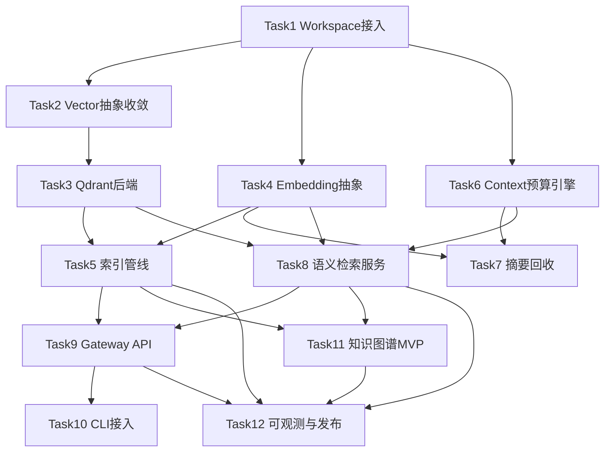

# Phase 3: Intelligence 实施计划

> **For Claude:** REQUIRED SUB-SKILL: Use superpowers:executing-plans to implement this plan task-by-task.

**Goal:** 在 Phase 2（AI Provider、持久化、CLI）基础上，落地 Phase 3 智能能力：向量存储、上下文引擎、语义检索、知识图谱最小可用链路。

**Architecture:** 以 `nexis-vector`（向量能力）和 `nexis-context`（上下文能力）为核心，通过 `nexis-gateway` 进行消息摄入与检索编排，通过 `nexis-runtime` 提供嵌入/摘要能力，并由 `nexis-cli` 暴露用户入口。采用“先本地抽象、后外部依赖（Qdrant）”的渐进式交付。

**Tech Stack:** Rust workspace, tokio, axum, qdrant-client, sqlx(PostgreSQL), reqwest, tracing, tokio-test/集成测试。

---

## 1. 当前代码库模块结构分析（As-Is）

### 1.1 Workspace 与 crate 拓扑

- Workspace members（`Cargo.toml`）：`nexis-core`、`nexis-protocol`、`nexis-mcp`、`nexis-gateway`、`nexis-runtime`、`nexis-cli`
- 已存在但未纳入 workspace 的新骨架：`crates/nexis-vector`、`crates/nexis-context`
- 直接影响：Phase 3 两个核心模块尚未被 `cargo check --workspace` 与 CI 覆盖

### 1.2 各模块职责（现状）

- `nexis-protocol`: 身份、消息、权限等协议模型（NIP 相关）
- `nexis-core`: 对协议层的再导出与领域扩展
- `nexis-runtime`: AI provider 抽象、OpenAI/Anthropic provider、provider registry
- `nexis-gateway`: axum 路由与消息接口；当前路由层主要使用内存态（`router/mod.rs`）
- `nexis-cli`: REPL + 命令式客户端，支持 `@ai` 调用 provider
- `nexis-vector`（骨架）:
  - 已有 `VectorStore` trait + `InMemoryVectorStore`
  - 已有 `Vector/Document/SearchQuery/SearchResult` 基础模型
  - Qdrant 为可选 feature，但尚无完整后端实现链路
- `nexis-context`（骨架）:
  - 已有 `ConversationContext/Message/ContextWindow/ContextManager`
  - 已有溢出策略枚举（截断/摘要/失败）
  - 摘要策略仍是 TODO（未接真实摘要能力）

### 1.3 Phase 3 关键差距（从“骨架”到“可用”）

- 工程接入差距：Phase 3 crate 未纳入 workspace 与依赖图
- 能力差距：Qdrant 实现、嵌入生成抽象、上下文摘要流水线缺失
- 业务接入差距：Gateway 消息写入后未触发向量化/索引；检索 API 未对外
- 产品可用差距：CLI 缺少语义检索/上下文调试入口
- 质量差距：缺少 Phase 3 的 e2e、性能基线、可观测指标

---

## 2. 实施范围与里程碑

- M3.1 基础接入：workspace + crate 边界稳定
- M3.2 向量能力：Qdrant 后端 + 索引/检索服务
- M3.3 上下文能力：窗口管理 + 摘要回收 + 检索融合
- M3.4 产品接入：gateway API + CLI 命令
- M3.5 质量闭环：e2e、性能、可观测、文档

---

## 3. Task 列表（含输入/输出、依赖、验证、工时）

### Task 1: Phase 3 模块纳入 Workspace

**输入**
- 现有骨架：`crates/nexis-vector`、`crates/nexis-context`
- 当前 workspace 配置：`Cargo.toml`

**输出**
- 两个 crate 纳入 workspace members
- workspace 依赖补齐（含 `qdrant-client` 版本统一）
- CI 可执行 `cargo check --workspace`

**依赖关系**
- 无（起始任务）

**验证标准**
- `cargo check --workspace` 成功
- CI 本地等价命令通过

**预计工作量**
- 0.5 人天

---

### Task 2: `nexis-vector` 领域模型与抽象收敛

**输入**
- 当前 `types.rs`、`store.rs`、`error.rs`
- 检索需求：按 room/time/tag/filter 查询

**输出**
- 稳定的 `Document`/`SearchQuery`/`SearchResult` 模型（含 metadata/filter）
- `VectorStore` trait 明确能力边界（upsert/batch/search/delete/get）
- 错误类型分层（参数错误、存储错误、后端错误）

**依赖关系**
- 依赖 Task 1

**验证标准**
- 单元测试覆盖：维度校验、filter、生效排序
- 文档注释覆盖公共 API

**预计工作量**
- 1 人天

---

### Task 3: Qdrant 后端实现（`nexis-vector`）

**输入**
- `VectorStore` trait
- Qdrant 连接配置（URL、collection、vector dim）

**输出**
- `QdrantVectorStore` 实现（feature-gated）
- collection 初始化、索引写入、相似度检索、删除/查询
- 与 in-memory 实现可互换

**依赖关系**
- 依赖 Task 2

**验证标准**
- `cargo test -p nexis-vector --features qdrant`
- 与本地 Qdrant 容器集成测试通过
- 异常场景：连接失败、collection 不存在、维度不匹配

**预计工作量**
- 1.5 人天

---

### Task 4: 嵌入生成抽象（Runtime 侧）

**输入**
- `nexis-runtime` 现有 provider 架构
- Phase 3 对 embedding 的调用需求

**输出**
- Embedding provider trait（可与文本生成能力解耦）
- OpenAI/Anthropic 最小 embedding 适配（至少一条生产可用路径）
- 重试/限流/错误映射策略

**依赖关系**
- 依赖 Task 1

**验证标准**
- provider 单测（mock）通过
- 真实 API smoke test 可生成向量并写入 vector crate

**预计工作量**
- 1.5 人天

---

### Task 5: 索引管线（Gateway 持久化事件 -> 向量入库）

**输入**
- Gateway 消息写入路径
- Task 3（VectorStore）+ Task 4（Embedding）

**输出**
- 消息写入后异步触发 embedding + vector upsert
- 失败重试与死信/补偿策略（至少日志可追溯）
- 幂等处理（重复消息不会重复污染索引）

**依赖关系**
- 依赖 Task 3、Task 4

**验证标准**
- 集成测试：发送消息后可被语义检索命中
- 故障注入：embedding 失败不阻塞主写路径

**预计工作量**
- 2 人天

---

### Task 6: `nexis-context` 上下文窗口与预算引擎强化

**输入**
- `ContextManager`、`ContextWindow` 现有实现
- 模型上下文预算约束（max_tokens/reserved_tokens）

**输出**
- 可配置的 token 估算/计数策略
- 窗口裁剪策略稳定化（按角色优先级保留 system/recent turns）
- 上下文快照接口（供诊断与 CLI 展示）

**依赖关系**
- 依赖 Task 1

**验证标准**
- 单元测试：窗口溢出、边界 token、优先级保留
- 对外 API 行为可预测（同输入同输出）

**预计工作量**
- 1.5 人天

---

### Task 7: 上下文摘要回收链路（Summarize 策略落地）

**输入**
- `OverflowStrategy::Summarize` 当前 TODO
- Runtime 文本生成能力

**输出**
- 摘要器接口 + provider 实现
- 溢出时将历史对话压缩为摘要消息并回写上下文
- 摘要质量元数据（来源消息范围、token 压缩率）

**依赖关系**
- 依赖 Task 4、Task 6

**验证标准**
- 集成测试：长对话溢出后仍可维持语义连续性
- 监控指标：摘要触发次数、压缩率

**预计工作量**
- 2 人天

---

### Task 8: 语义检索服务层（Context + Vector 融合）

**输入**
- Task 3 向量检索能力
- Task 6/7 上下文能力

**输出**
- Retrieval service：query -> embedding -> vector search -> rerank -> context pack
- 检索参数策略（top_k/min_score/room filter/time window）
- 统一返回结构供 gateway/cli 复用

**依赖关系**
- 依赖 Task 3、Task 4、Task 6

**验证标准**
- 语义相关性基准测试（离线样本）
- 单次检索 P95 延迟达到目标（建议 < 300ms，不含外部 API）

**预计工作量**
- 2 人天

---

### Task 9: Gateway Phase 3 API 接入

**输入**
- Task 5 索引管线
- Task 8 检索服务

**输出**
- 新增检索接口（示例：`POST /v1/search/semantic`）
- 新增上下文接口（示例：`GET /v1/contexts/:id`）
- 请求鉴权、输入校验、错误码映射

**依赖关系**
- 依赖 Task 5、Task 8

**验证标准**
- API 集成测试通过
- 与 CLI 端到端联通

**预计工作量**
- 1.5 人天

---

### Task 10: CLI 智能命令接入

**输入**
- Task 9 API
- `nexis-cli` REPL 框架

**输出**
- 新命令：`search-semantic`、`context show`（命名可微调）
- 结果展示（相关度、命中来源、截断摘要）
- 调试开关（显示 token 用量/检索参数）

**依赖关系**
- 依赖 Task 9

**验证标准**
- CLI e2e：创建房间 -> 发消息 -> 语义检索命中
- UX 基线：输出稳定、错误提示可操作

**预计工作量**
- 1 人天

---

### Task 11: 知识图谱最小可用（MVP）

**输入**
- 已持久化消息与 metadata
- Phase 3 检索链路

**输出**
- 最小 schema：实体（人/房间/主题）与关系（提及/参与/关联）
- 构建任务（增量提取）与查询接口（只读）
- 与语义检索并行返回“结构化补充证据”

**依赖关系**
- 依赖 Task 5、Task 8

**验证标准**
- 图谱构建集成测试通过
- 对同一查询可返回至少一条结构化关联

**预计工作量**
- 2 人天

---

### Task 12: 可观测性、性能与发布门禁

**输入**
- Task 1-11 产物

**输出**
- 指标：索引延迟、检索延迟、摘要触发率、Qdrant 错误率
- 压测与容量基线（QPS、P95/P99）
- Phase 3 文档与运维说明（配置、故障排查、回滚）

**依赖关系**
- 依赖 Task 5、Task 8、Task 9、Task 11

**验证标准**
- 性能报告达标
- 关键路径告警可触发
- 发布检查清单全部通过

**预计工作量**
- 1.5 人天

---

## 4. 依赖关系总览

---

## 5. 验证标准（全局 Definition of Done）

- 功能正确性
  - 消息写入后可被语义检索命中
  - 长对话在窗口溢出后仍可维持可用上下文
  - 检索结果包含可解释字段（score/source/filter）
- 工程质量
  - `cargo fmt`、`cargo clippy --workspace --all-features -D warnings` 通过
  - `cargo test --workspace --all-features` 通过
  - Phase 3 新增模块单测+集成测试覆盖关键路径
- 性能与稳定性
  - 核心 API（semantic search）满足目标 P95
  - 索引失败具备重试与可观测日志，不影响主消息写入
- 可运维性
  - 配置项文档化（Qdrant、Embedding provider、context window）
  - 指标可观测且具备基础告警阈值

---

## 6. 预计工作量汇总

- 总计：约 **18 人天**（单人顺序执行约 4 周；2 人并行约 2 周）
- 并行建议：
  - 轨道 A：Task 2/3/5/8（Vector & Retrieval）
  - 轨道 B：Task 4/6/7/10（Runtime & Context & CLI）
  - 汇合：Task 9/11/12
- 风险缓冲：建议增加 15%（约 2.5 人天）用于外部 API 波动与检索质量调参

---

## 7. 主要风险与缓解

- 风险 1：Gateway 当前内存路由与持久化路径并存，接入点不一致
  - 缓解：Task 5 前先定义唯一“消息入库后事件”接口，避免双写路径漂移
- 风险 2：Embedding 成本与延迟不稳定
  - 缓解：批量化、缓存、异步队列、降级为关键词检索
- 风险 3：摘要导致语义损失
  - 缓解：保留关键 turn（system/recent user）+ 摘要质量回归样本
- 风险 4：检索结果难解释
  - 缓解：统一返回检索依据（score/filter/source）并加入调试输出

---

## 8. 执行顺序建议

1. Week 1: Task 1-4（基础接入 + 向量后端 + embedding 抽象）
2. Week 2: Task 5-8（索引管线 + 上下文 + 检索服务）
3. Week 3: Task 9-11（API/CLI/知识图谱）
4. Week 4: Task 12（性能、可观测、发布门禁与收尾）

